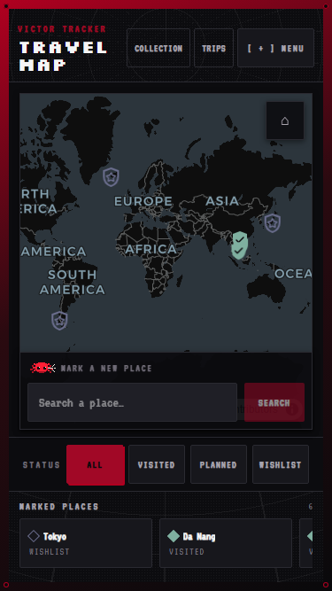
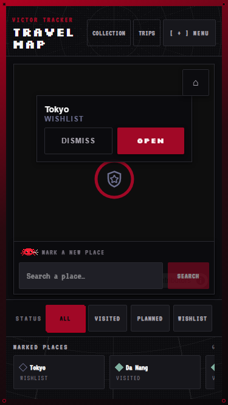
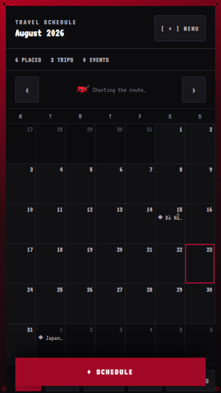
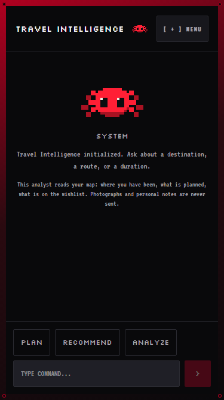
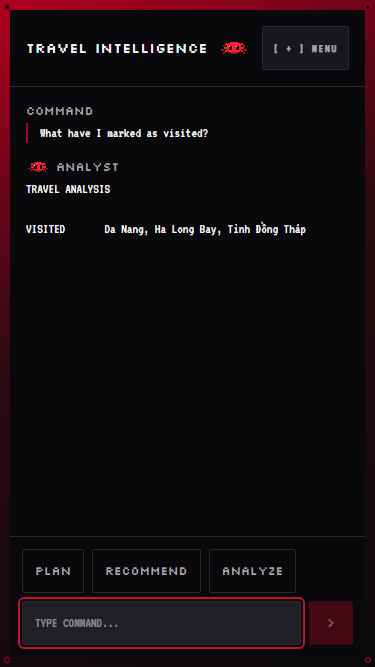
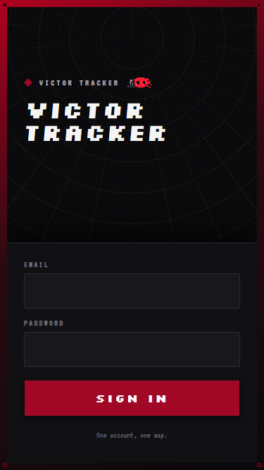

# Victor Tracker

A private, single-user travel memory map. One account, one map of every place you've been, want to
go, or have planned — with photographs and notes on the ones you've visited, a schedule for the
ones coming up, and an AI console that can actually answer questions about your own trips because
it reads the same data the map does.

<p align="center">
  
</p>

## What it does

**A world map you actually mark up.** Every place gets a pin — a shield that's hollow for
wishlist, half-filled for planned, solid for visited — so you can read status at a glance, in
grayscale, without tapping anything. Search a real place by name, drop a pin, done in three taps.
Group places into Trips, and a Destination whose dates fall outside its Trip's range gets flagged,
not silently ignored.

<p align="center">
  
</p>

**A schedule for what's ahead.** `/schedule` lays Trips and travel events — flights, stays,
activities, food, notes — onto a real month calendar, with an upcoming list and a per-day detail
sheet. It's a second view of the same data the map holds, not a separate thing to keep in sync.

<p align="center">
  
</p>

**An AI console that reads your actual trips.** `/intel` is a chat interface backed by any
OpenAI-compatible provider (Groq, Hugging Face's router, OpenRouter, a local model — swappable in
two lines of `.env`). It's grounded in your real Trips and Destinations, so it answers "where have
I been" by naming your actual places, not by guessing.

<p align="center">
  
  
</p>

**One privacy line, drawn on purpose and enforced by tests.** The AI reads everything about your
destinations and trips *except* photographs and personal notes — those never leave the database.
`backend/tests/test_ai_context.py` asserts the absence, not just the presence, of that boundary.

<p align="center">
  
</p>

## Why it exists

This is a solo, learning-driven build — not a product with users to onboard. The point was working
through a real full-stack app end to end: a Postgres-backed API with real auth, a map that draws
real tiles and real markers, a provider-neutral LLM integration grounded in first-party data, and a
CI/CD pipeline that actually gates merges. The `ai/` directory even holds a small fine-tuning
experiment — a dataset, a training notebook, and the honest result (it learned the output *format*
perfectly and got the *facts* wrong, which is its own useful lesson).

## Stack

| Layer | Choice |
|---|---|
| Backend | FastAPI, Python 3.13, SQLModel + Alembic, PostgreSQL, `uv` |
| Frontend | Next.js (App Router), TypeScript, Tailwind 4, `pnpm` |
| Map | MapLibre GL JS over CARTO's free dark-matter basemap |
| AI | Any OpenAI-compatible chat-completions endpoint (provider-neutral by design) |
| Object storage | Cloudflare R2, presigned PUT/GET — photographs only, never a public bucket |
| Auth | JWT, single seeded account, sliding session reissue, no refresh token |
| Tests | pytest (backend), Playwright (frontend — unit, contract, proxy, and real-browser flows) |
| CI/CD | GitLab CI: build → test → review → deploy, merge-request gated |

## Running it locally

```bash
cp .env.example .env          # fill in JWT_SECRET, SEED_CREATOR_EMAIL/PASSWORD at minimum
docker compose up -d db backend
docker compose exec backend uv run python -m app.scripts.seed_user   # creates the one account
```

```bash
cd frontend
pnpm install
pnpm build && API_BASE_URL=http://127.0.0.1:8000 SESSION_COOKIE_SECURE=false pnpm start
```

Open `http://localhost:3000`, sign in with the seed credentials, and use it at a phone width
(375px) — that's the floor this product is actually designed for; desktop is an enhancement, not
the target.

Want the AI console working too? Add `AI_BASE_URL`, `AI_API_KEY`, and `AI_MODEL` to `.env` for any
OpenAI-compatible provider — see the comments in `.env.example` for what each does and how the
fallback behaves.

## Testing

```bash
cd backend && uv run pytest                    # 291 tests
cd frontend && pnpm exec playwright test        # ~356 tests across four projects
```

## Project layout

```
backend/        FastAPI app, Alembic migrations, pytest suite — see backend/AGENTS.md
frontend/       Next.js app, Playwright suite — see frontend/AGENTS.md
ai/             Fine-tuning experiment: dataset, training notebook, scored results
specs/          Feature specs (spec/plan/tasks) for the iterations built under the SpecKit workflow
docs/           Retros and this README's screenshots
```

`CLAUDE.md` and `.claude/memory.md` carry the full build history and the reasoning behind
non-obvious decisions, if you want the long version.
