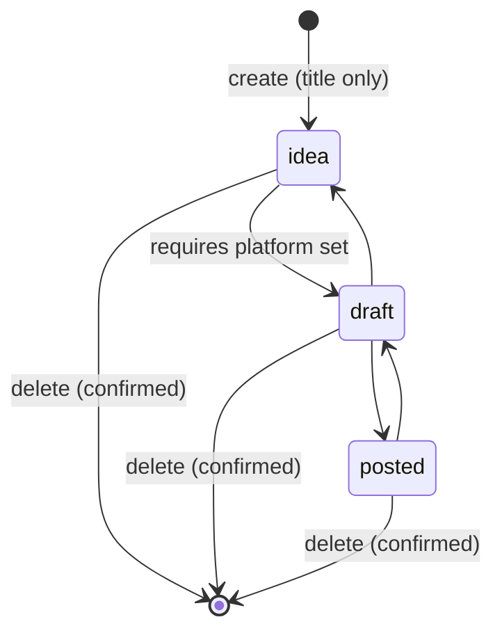

# Phase 1 Data Model: Content Calendar

**Feature**: `001-content-calendar` | **Date**: 2026-07-30 | **Plan**: [plan.md](./plan.md)

Two tables. The spec describes one entity that matters (`content_item`) and one that exists only so a
password hash has somewhere to live (`creator`).

---

## Enumerations

Both are database enums rather than free text, so an invalid value cannot be stored at all.

```python
class Status(str, Enum):
    IDEA = "idea"
    DRAFT = "draft"
    POSTED = "posted"

class Platform(str, Enum):
    TIKTOK = "tiktok"
    INSTAGRAM = "instagram"
    YOUTUBE = "youtube"
```

`Status` is ordered for comparison purposes — `idea < draft < posted` — but the ordering lives in a
module-level tuple rather than in the enum values, because FR-008 makes movement bidirectional and an
integer-valued enum would invite arithmetic on it.

`Platform` is a closed set per FR-010: the creator cannot add to it, so it is not a table.

---

## `content_item`

| Column | Type | Null | Default | Requirement |
|---|---|---|---|---|
| `id` | `INTEGER` PK | no | identity | — |
| `title` | `VARCHAR(200)` | **no** | — | FR-005 — the only field required to create |
| `hook` | `VARCHAR(500)` | yes | `NULL` | FR-006 |
| `platform` | `platform` enum | yes | `NULL` | FR-006, FR-010, FR-010a — at most one |
| `scheduled_date` | `DATE` | yes | `NULL` | FR-006, FR-012a — date only, see research.md R-006 |
| `status` | `status` enum | **no** | `'idea'` | FR-007 |
| `published_url` | `VARCHAR(2048)` | yes | `NULL` | FR-006, FR-019 |
| `created_at` | `TIMESTAMPTZ` | no | `now()` | Backlog ordering (Assumptions) |
| `updated_at` | `TIMESTAMPTZ` | no | `now()` on write | FR-023 — supports last-write-wins diagnosis |

**Indexes**

- `ix_content_item_scheduled_date` on `scheduled_date` — every calendar read is a date-range query.
- `ix_content_item_status` on `status` — cheap, and the pipeline view groups by it.
- Partial index on `created_at DESC WHERE scheduled_date IS NULL` — the backlog query, which is the
  other of the two reads this feature performs.

**Columns deliberately absent**

| Not present | Why |
|---|---|
| `user_id` / `owner_id` / `tenant_id` | Constitution principle VII and FR-003. There is one creator; a foreign key to a single row is decoration that taxes every query and migration. |
| `version` / `etag` / `lock_version` | FR-023a specifies last-write-wins with no detection. A version column with nothing reading it is the speculative infrastructure principle VII names. |
| `scheduled_time`, `timezone` | FR-012a forbids a time component anywhere. See research.md R-006. |
| `platform_ids` (many-to-many) | FR-010a — at most one platform per item. Widening this later is additive; see Deferred in `.claude/memory.md`. |
| `sort_order` | Backlog ordering is by `created_at DESC` per the Assumptions section. Manual reordering is deferred. |
| `deleted_at` | FR-004 says delete; nothing in the spec asks for recovery. FR-020's confirmation is the safeguard. |

---

## Invariants

These are the rules the tests in `backend/tests/test_transitions.py` exist to hold down. Each is
enforced at the API boundary, and the ones expressible in SQL are additionally enforced as a table
constraint — a check that lives only in application code is a check that a future migration script can
bypass.

**INV-1 — platform is present past `idea`** (FR-009, FR-009a)

> `status = 'idea' OR platform IS NOT NULL`

A table `CHECK` constraint. This is the invariant that makes FR-009 and FR-009a a single rule instead
of two: advancing without a platform and clearing a platform while advanced are both just attempts to
violate it. It holds for every stored row at all times, which is what the spec says.

**INV-2 — title is non-empty** (FR-005)

> `length(trim(title)) > 0`

A `CHECK` constraint. `NOT NULL` alone permits `''`, and an item whose title is a space is
indistinguishable from a bug in the capture sheet.

**INV-3 — backward transitions preserve every field** (FR-008a, FR-019a)

Not a constraint but an absence: no code path clears `platform` or `published_url` as a side effect of
a status change. Enforced by a test that sets every field, walks `posted → draft → idea`, and asserts
all fields survive. Named here because "we simply don't do that" is the kind of guarantee that decays
silently.

**INV-4 — no owner** (FR-003, constitution VII)

Enforced by a test asserting the `content_item` table has no column matching `%user%`, `%owner%`,
`%tenant%`, or **`%creator%`**, and no foreign key at all. A test rather than a review note, because
principle VII is listed in the constitution as a recurring offender.

`%creator%` was added at T019, when writing the test made the omission obvious: the first three
patterns are the generic vocabulary of multi-tenancy, but the owner entity in *this* schema is called
`creator`, so a `creator_id` foreign key — the one column this project would actually add — matched
none of them. The pattern list is a proxy for the rule; the rule is "no owner", and the accompanying
allowlist test asserts the exact column set so that an owner column under any name at all fails.

---

## State transitions



- Every forward edge out of `idea` is gated on INV-1. The other forward edge is unconditional.
- Backward edges are unconditional and lossless (INV-3).
- `idea → posted` directly is permitted, subject to INV-1. The spec orders the states but never
  requires passing through each one, and a creator who films and publishes in one sitting should not
  have to tap through `draft` to record it. (An earlier draft justified this by a drag onto a `posted`
  lane; that surface no longer exists after the FR-015a amendment, but the reason above stands on its
  own.)
- Overdue is **not** a state. It is a derived property: `scheduled_date < today AND status != 'posted'`.
  Computed at render time, never stored, so it cannot go stale — and so FR-007's three states stay
  three.

  `today` comes from the **browser's clock, in a client component only**. It is never evaluated during
  server rendering: Vercel's clock is UTC, so a creator in UTC+7 at 06:00 would see an item flip from
  not-overdue to overdue between server HTML and hydration. `DATE` storage makes the off-by-one
  unrepresentable in the data; this comparison is the one place it could still appear. See research.md
  R-006's addendum and R-007.

---

## `creator`

| Column | Type | Null | Requirement |
|---|---|---|---|
| `id` | `INTEGER` PK | no | — |
| `email` | `VARCHAR(320)` unique | no | login identifier |
| `password_hash` | `VARCHAR(255)` | no | FR-001 |
| `created_at` | `TIMESTAMPTZ` | no | — |

Populated only by `uv run python -m app.scripts.seed_user`. There is no registration endpoint, no
password reset, and no email verification — `tech-defaults.md` and the Assumptions section both say so.

No relationship to `content_item`. That is deliberate and is INV-4.

---

## Requirement traceability

Every field and rule above maps to a numbered requirement. Anything in a future migration that maps to
nothing is drift, and `/speckit-analyze` should catch it.

| Requirement | Realised by |
|---|---|
| FR-001, FR-002 | `creator.password_hash`; auth dependency on every content route |
| FR-002a | Token expiry and sliding reissue (research.md R-002) — no schema involvement |
| FR-003 | Absence of any owner column; INV-4 |
| FR-004 | `POST`, `GET`, `PATCH`, `DELETE /content-items` |
| FR-005 | `title NOT NULL`; every other column nullable or defaulted; INV-2 |
| FR-006 | `hook`, `platform`, `scheduled_date`, `published_url`, all nullable |
| FR-006a | `PATCH` accepts every one of them; the item sheet is the single surface that sets them. **This is the requirement the first draft had no design for** — nothing assigned a platform, so INV-1 made every item permanently unreachable past `idea`. |
| FR-007 | `status` enum, default `'idea'` |
| FR-008 | Bidirectional edges in the transition diagram |
| FR-008a | INV-3 |
| FR-009, FR-009a | INV-1 |
| FR-010, FR-010a | `platform` as a single-valued enum column |
| FR-011 | Backlog query — `scheduled_date IS NULL`; partial index |
| FR-012, FR-012a | `scheduled_date DATE`; research.md R-006 |
| FR-013 | Date-range query on `scheduled_date`; `ix_content_item_scheduled_date` |
| FR-014, FR-014a | Partial `PATCH` on `scheduled_date` — one endpoint, reached by drag or by tap (research.md R-003) |
| FR-015, FR-015a, FR-015b | Partial `PATCH` on `status`, reached by tap only. Status is not draggable — see the FR-015a amendment in spec.md's post-review clarification |
| FR-016 | Optional `platform` query parameter on list, plus client-side narrowing of the loaded list — the whole list, read once, not a period (research.md R-007 and its Phase 4 amendment) |
| FR-017, FR-018 | `status` and `platform` returned on every list row so no follow-up read is needed to render a cue |
| FR-019, FR-019a | `published_url` nullable and never auto-cleared; INV-3 |
| FR-020 | Frontend confirmation before `DELETE`; no schema involvement |
| FR-021, FR-022 | Frontend layout; no schema involvement |
| FR-023 | Persistence; `updated_at` |
| FR-023a | Absence of a version column |
