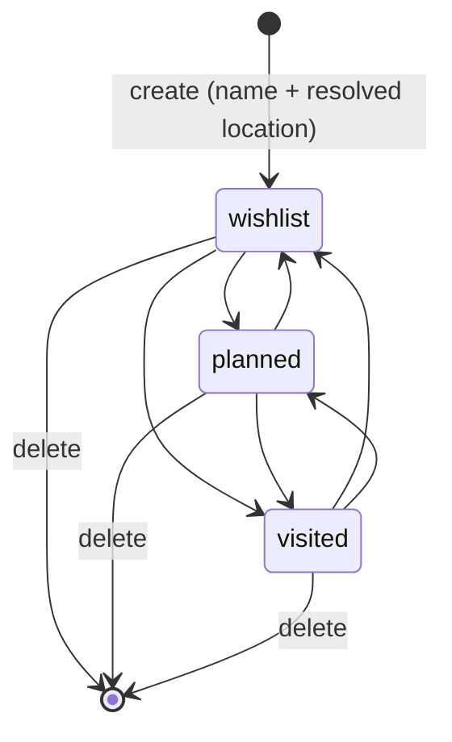

# Phase 1 Data Model: Travel Map

**Feature**: `003-travel-map` | **Date**: 2026-08-14 | **Plan**: [plan.md](./plan.md)

Three tables. `trip` and `destination` realise the spec's two organising entities; `photograph`
exists only to hold an object-storage key per image — never bytes (FR-025).

---

## Enumerations

```python
class DestinationStatus(str, Enum):
    VISITED = "visited"
    PLANNED = "planned"
    WISHLIST = "wishlist"

class TripStatus(str, Enum):
    WISHLIST = "wishlist"
    PLANNED = "planned"
    BOOKED = "booked"
    UPCOMING = "upcoming"
    TRAVELING = "traveling"
    COMPLETED = "completed"
```

`DestinationStatus` is the one that drives a map pin (FR-002, FR-026) and is unconstrained in the
direction it may change (FR-028) — no ordering table, unlike `001`'s `Status`, because there is no
sequence to preserve.

`TripStatus` carries the draft's own six-stage vocabulary (§2) descriptively; it drives no pin and no
requirement in this spec depends on its exact values beyond "a status exists" (FR-014). Kept as an
enum rather than free text for the same reason `001` keeps `Status` and `Platform` as enums — an
invalid value should be unstorable, not merely unexpected.

"Currently Traveling" is **not a value of either enum** — see State Transitions below and research.md
R-004.

---

## `trip`

| Column | Type | Null | Default | Requirement |
|---|---|---|---|---|
| `id` | `INTEGER` PK | no | identity | — |
| `name` | `VARCHAR(200)` | **no** | — | FR-014 |
| `start_date` | `DATE` | **no** | — | FR-014 |
| `end_date` | `DATE` | **no** | — | FR-014 |
| `status` | `tripstatus` enum | **no** | `'wishlist'` | FR-014 |
| `created_at` | `TIMESTAMPTZ` | no | `now()` | — |
| `updated_at` | `TIMESTAMPTZ` | no | `now()` on write | — |

**Indexes**: none beyond the primary key. A Trip is read by id (opening it) or listed in full (an
owner with a personal number of trips) — no query shape here needs one, unlike `content_item`'s
date-range and backlog reads.

---

## `destination`

| Column | Type | Null | Default | Requirement |
|---|---|---|---|---|
| `id` | `INTEGER` PK | no | identity | — |
| `trip_id` | `INTEGER` FK → `trip.id`, `ON DELETE CASCADE` | **yes** | `NULL` | FR-020 — a Destination MAY exist with no Trip |
| `name` | `VARCHAR(200)` | no | — | FR-015 |
| `latitude` | `DOUBLE PRECISION` | **no** | — | FR-011 — never null once saved |
| `longitude` | `DOUBLE PRECISION` | **no** | — | FR-011 — never null once saved |
| `start_date` | `DATE` | yes | `NULL` | FR-015, FR-020 — nullable; see note below |
| `end_date` | `DATE` | yes | `NULL` | FR-015, FR-020 — nullable; see note below |
| `status` | `destinationstatus` enum | **no** | `'wishlist'` | FR-002, FR-026 |
| `note` | `TEXT` | yes | `NULL` | FR-006 |
| `created_at` | `TIMESTAMPTZ` | no | `now()` | Map/list ordering |
| `updated_at` | `TIMESTAMPTZ` | no | `now()` on write | — |

**Why `start_date`/`end_date` are nullable, against §12's own "required" listing**: §12 lists them as
MVP-required, but that list describes the Trip-organising flow (§3), which is not the only path to a
Destination this spec supports. The Quick Add flow (§11) offers **"No date yet"** as one of its three
choices alongside "This trip" and "Future trip" — text that only makes sense if a Destination can be
saved with no dates at all. A NOT NULL constraint here would make that documented flow impossible.
FR-017's containment check (a Destination's range against its Trip's) simply does not apply when
either range is absent — there is nothing to compare.

**Indexes**

- `ix_destination_trip_id` on `trip_id` — "this Trip's Destinations" is the query User Story 3 needs.
- `ix_destination_status` on `status` — the map's status filter (FR-010) is a `WHERE status = …` on
  every read.

**Columns deliberately absent**

| Not present | Why |
|---|---|
| `category`, `priority` | Out of scope for this iteration (spec.md Assumptions) — §4's category filter and priority are V2. |
| `currently_traveling` | Computed client-side, never stored — research.md R-004. |
| `user_id` / `owner_id` | Constitution principle VII, same reasoning as `001`'s `content_item`. |
| `cost`, `transportation_id`, `accommodation_id` | Budget and cost fields are out of scope for this iteration (spec.md, "Why this iteration…") despite being constitutionally permitted since the 2.1.0 amendment. |
| `sequence` / `order` | Route display is out of scope; nothing reads a Destination order in this iteration. |

---

## `photograph`

| Column | Type | Null | Default | Requirement |
|---|---|---|---|---|
| `id` | `INTEGER` PK | no | identity | — |
| `destination_id` | `INTEGER` FK → `destination.id`, `ON DELETE CASCADE` | **no** | — | FR-007 |
| `object_key` | `VARCHAR(512)` | **no** | — | FR-024, FR-025 — the R2 key; never bytes |
| `created_at` | `TIMESTAMPTZ` | no | `now()` | Gallery ordering |

**Index**: `ix_photograph_destination_id` on `destination_id` — every read is "this Destination's
photographs."

**No `caption` or `order` column.** Neither is asked for anywhere in the spec; a photograph is
attached, viewable, and belongs to exactly one Destination (FR-007, FR-008), and that is the whole of
what this iteration needs from it.

---

## Invariants

**INV-1 — a Destination always has real coordinates** (FR-011)

`latitude`/`longitude` are `NOT NULL` with no default. There is no code path that inserts a
Destination before geocoding succeeds — FR-012 requires the owner be told plainly on a failed search,
which is a rejected write, not a write with placeholder coordinates. Unlike `001`'s INV-1 (a `CHECK`
expressible from other columns on the same row), this is enforced entirely by **never calling the
insert path without both values already resolved** — there is nothing in `latitude`/`longitude`'s own
values that a `CHECK` could distinguish from a legitimate coordinate (0,0 is a real place in the
Gulf of Guinea), so the guarantee lives in the API layer's control flow, not in SQL.

**INV-2 — no owner column** (constitution VII)

Same shape as `001`'s INV-4: a test asserts neither `trip`, `destination`, nor `photograph` has a
column matching `%user%`, `%owner%`, `%tenant%`, or `%creator%`, and no foreign key to `creator` at
all. This product's one account is authenticated to use the API; nothing it stores is partitioned by
who owns it, because no row is shared.

**INV-3 — a Destination's status is independent of whether it has photographs or a note**

Not a constraint, an absence: photographs and a note MAY exist on a Destination in any status. FR-009
("Planned/Wishlist offers no gallery") is a **frontend** rule about what is *shown*, not a database
rule about what may be *stored* — if the owner sets a Destination back to Wishlist after having
marked it Visited and added photographs (FR-028 permits this), the photographs are not deleted, only
no longer surfaced until the status returns to Visited. Recorded here so a future migration does not
"clean up" data on the mistaken belief that Wishlist Destinations should have none.

---

## State transitions



Every edge is unconditional (FR-028) — the diagram is complete rather than illustrative; there is no
sixth edge missing. "Currently Traveling" is drawn as absent on purpose: it is not a node, because it
is never a stored value (research.md R-004). It renders as an overlay on `planned` whenever the
client's `today()` falls within that Destination's own `start_date`/`end_date` — computed at read
time, the same way `content_item`'s overdue treatment is computed and never stored (`001`'s
data-model.md, State transitions).

---

## Requirement traceability

| Requirement | Realised by |
|---|---|
| FR-001, FR-019 | `destination` has no required `trip_id`; every row renders regardless |
| FR-002, FR-026 | `destination.status` enum; client-computed Currently-Traveling overlay |
| FR-003, FR-004 | Frontend map component; no schema involvement |
| FR-005 | `GET` on a Destination always returns `note` and its `photograph` rows, regardless of `status` — INV-3; the `status === "visited"` gate is frontend display only (FR-009) |
| FR-006 | `destination.note` |
| FR-007, FR-008 | `photograph.object_key`, resolved to a presigned GET URL per read (FR-024) |
| FR-009 | Frontend gate on `status`; INV-3 |
| FR-010 | `ix_destination_status`; `status` query parameter on the list endpoint |
| FR-011, FR-012 | `latitude`/`longitude` `NOT NULL`; INV-1; geocoding failure returns no row (research.md R-001) |
| FR-013 | Geocoding and tile requests carry no `destination`/`trip` field — research.md R-001 |
| FR-014 | `trip` table |
| FR-015, FR-020 | `destination` table; nullable `trip_id`, `start_date`, `end_date` |
| FR-016 | `PATCH`/`DELETE` on `trip` and `destination` |
| FR-017 | API-layer check comparing a Destination's dates against its Trip's, when both are present |
| FR-018 | `ON DELETE CASCADE` from `trip` to `destination` to `photograph`, gated behind a frontend confirmation naming what cascades |
| FR-021, FR-022 | `POST /destinations` accepts an optional `trip_id`; returns immediately, no separate confirmation step |
| FR-023, FR-024, FR-025 | `photograph.object_key`; presigned PUT/GET endpoints (contracts/openapi.yaml) |
| FR-027 | No `activity` table, no calendar endpoint — absence is the realisation |
| FR-028 | No transition table; every `status` value is a valid `PATCH` target from any other |
